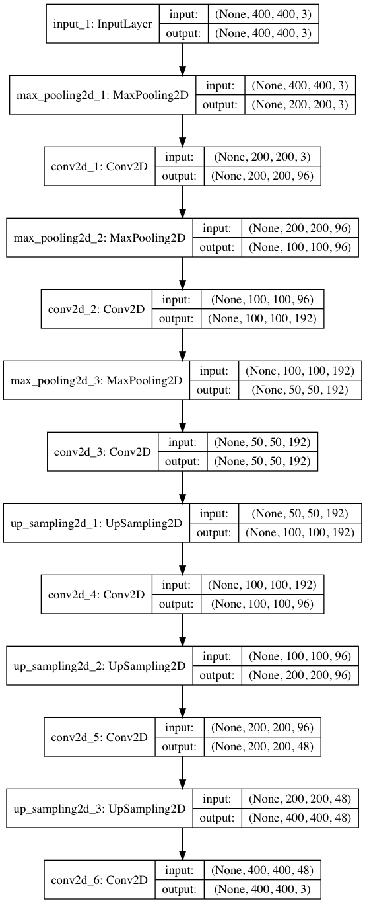

# Deep Geospatial Intelligence

A Keras Python project for detecting anomalies in geospatial maps

## News

-August 26, 2018: Initial Commit

## Requirements

* 11 GB VRAM

* Google static maps API

* Some neural bois

## Quickstart

